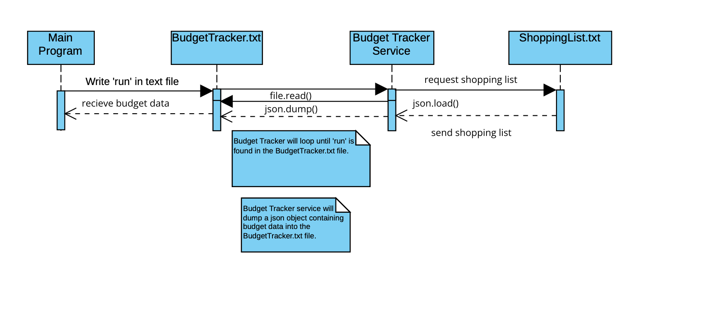

REQUESTING DATA

Requesting data will be done by writing the string 'run' into a file named BudgetTracker.txt. 

Example Request:

  with open(‘budgetTracker.txt’, ‘w’, encoding = ‘utf-8’) as file:
           file.write(‘run’)

RECIEVING DATA

Data will be recieved via the same BudgetTracker.txt file. Data will be in JSON format so you would need
to load it as JSON object. 

Example of Receiving:

Import json

  with open('BudgetTracker.txt','r', encoding='utf-8') as file:
        budgetInfo = json.load(file)

*Note: The json object will be in this form
{'Budget': 'budget message goes here', 'Top Items': ['banana', 'orange', 'Apple']}

UML

